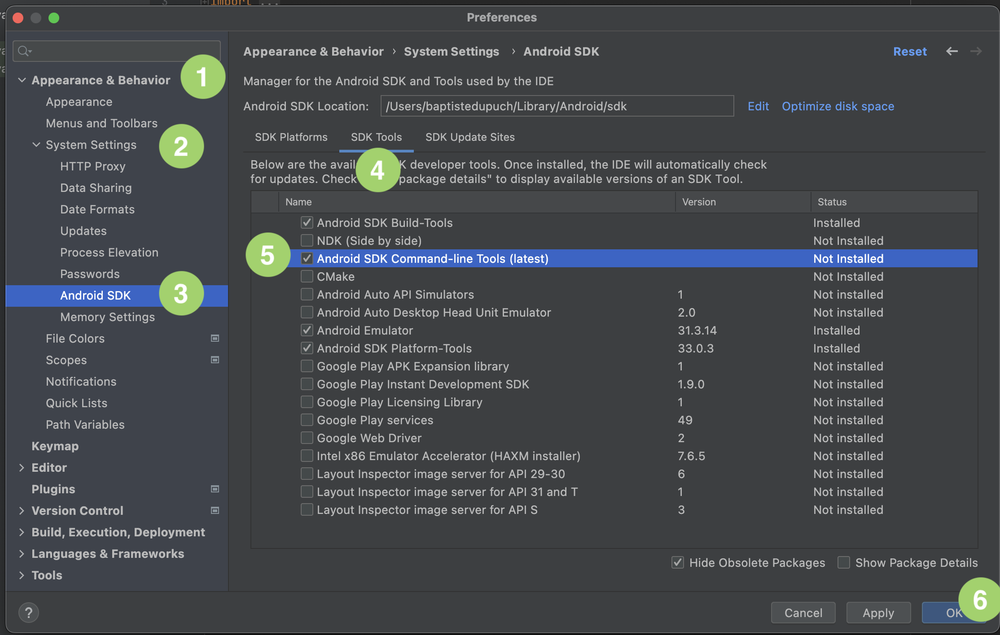
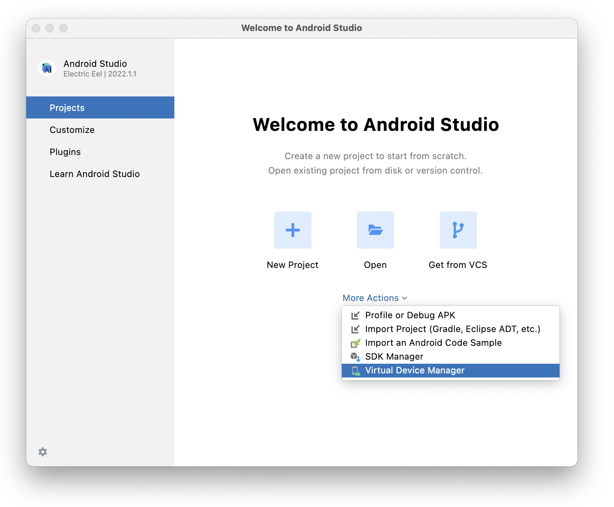
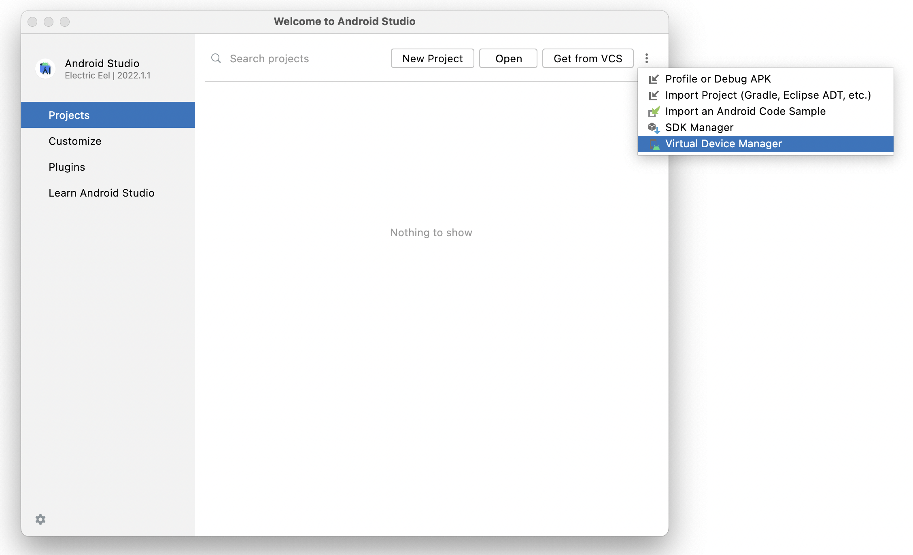
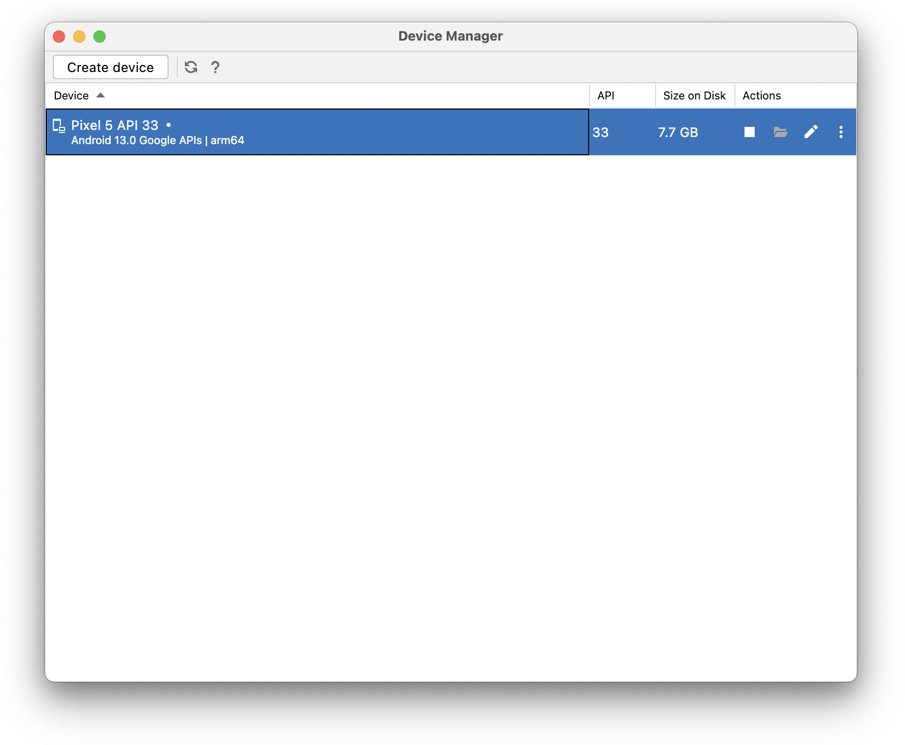

# ClojureDart+Flutter Quick Start

> Even if Flutter bundles its own Dart it's better to first try [ClojureDart](quick-start.md) alone first.

## System requirements

ClojureDart needs at least Java 8.

## 1. [Install the latest stable Flutter](https://flutter.dev/docs/get-started/install)

It's a tad laborious as you have to install dependencies.

## 2. [Install Clojure CLI Tools](https://clojure.org/guides/getting_started#_clojure_installer_and_cli_tools)

If you already have the `clj` command installed make sure to upgrade to at least the [1.10.3.814](https://clojure.org/releases/tools#v1.10.3.814). This release allows to easily use private git deps.

## 3. Create your first ClojureDart/Flutter project

Creates a directory for the project with the following deps.edn:

``` shell
mkdir hello
cd hello
cat << EOF > deps.edn
{:paths ["src"] ; where your cljd files are
 :deps {tensegritics/clojuredart
        {:git/url "https://github.com/tensegritics/ClojureDart.git"
         :sha "4518023cb5d0966ba9f7d34a488d799111fa8754"}}
 :aliases {:cljd {:main-opts ["-m" "cljd.build"]}}
 :cljd/opts {:kind :flutter
             :main acme.main}}
EOF
```

`acme.main` is the root namespace of the project where the `main` function is defined.

(To update an existing project to the latest ClojureDart, just do `clj -M:cljd upgrade`)

## 4. Initialize the project

``` shell
clj -M:cljd init
```

## 5. Create a ClojureDart file with a main entry-point

First create a directory where clojure files live

``` shell
mkdir -p src/acme
cat << EOF > src/acme/main.cljd
(ns acme.main
  (:require ["package:flutter/material.dart" :as m]
            [cljd.flutter :as f]))

(defn main []
  (f/run
    (m/MaterialApp
      .title "Welcome to Flutter"
      .theme (m/ThemeData .primarySwatch m.Colors/pink))
    .home
    (m/Scaffold
      .appBar (m/AppBar
                .title (m/Text "Welcome to ClojureDart")))
    .body
    m/Center
    (m/Text "Let's get coding!"
       .style (m/TextStyle
                .color m.Colors/red
                .fontSize 32.0))))
EOF
```

## 7. Start a simulator

### iOS and iPadOS

Install XCode if you don't have it yet. Starts it once to accept licenses.

In another terminal:

iOS:
``` shell
open -a Simulator
```
### Android
You can either use Android Studio or Genymotion.

#### Android Studio
Download Android Studio from https://developer.android.com/studio

:bulb: There's currently a small incompatibility between the latest Studio (Eels) and Flutter: Android Studio renamed the directory containing its JRE from `jre` to `jbr`. Go to where Android Studio is installed (eg for a typical MacOS install: `/Applications/Android Studio.app/Contents/`) and do `ln -s jbr jre` (you may need to `sudo` this command).

Now run `flutter doctor`. Android Studio shoud be fully green. Good job! However you still certainly have a warning about using a command-line tool name `sdkmanager` to install other command line tools. Something like this.

```
 ✗ cmdline-tools component is missing
      Run path/to/sdkmanager --install "cmdline-tools;latest"
      See https://developer.android.com/studio/command-line for more details.
```

The trick is that the SDK manager is a GUI in Android Studio:



Once everything is downloaded, run `flutter doctor` again, it will instruct you on how to accept licenses.

Now we are almost done, we only have to create the virtual device. This is done in Android Studio Virtual Device Manager which can be found from a buried on the welcome dialogs (plural):




Once in the device manager, you pick the device and then an Android version and you'll get your virtual device listed:



Now, `flutter emulators` lists:
```
2 available emulators:

apple_ios_simulator • iOS Simulator  • Apple  • ios
Pixel_5_API_33      • Pixel 5 API 33 • Google • android`
```

And `flutter emulators --launch Pixel_5_API_33` will start the emulator (maybe asking for some OS permissions the first time)!

#### Genymotion
Please follow [those guidelines](https://docs.genymotion.com/desktop/Get_started/Requirements/) to install and setup Genymotion.

* Configure the SDK **within Genymotion** (`Genymotion > Preferences > ADB > Use custom Android SDK tools`) then use the path `/$HOME/Android/sdk` (default location after installing Android Studio)

    * Create a new device within Genymotion

* In **Android Studio**

    * `Select Tools > SDK Manager > Plugins > Genymotion`, and restart Android Studio
    * Then, select `Files > Settings`
    * On the sidebar, select `Tools > Genymotion plugin`
    * Select the path to your Genymotion folder

* within your **flutter project**, run `flutter devices`: Genymotion should appear among connected devices. (make sure your genymotion device is still on)

## 8. Start the ClojureDart watcher

``` shell
clj -M:cljd flutter
```

## 9. Enjoy!

 When you edit your cljd file, the watcher recompiles cljd files and, on success, hot reloads the application. **Sometimes the application may not pick up your change so hit the return key to get the watcher to restart the application.**
